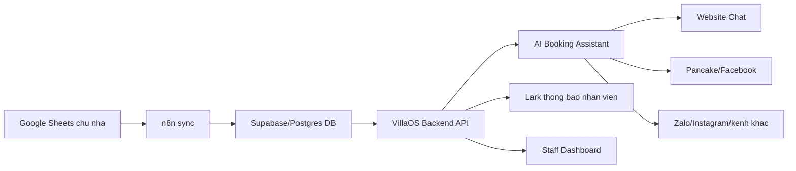
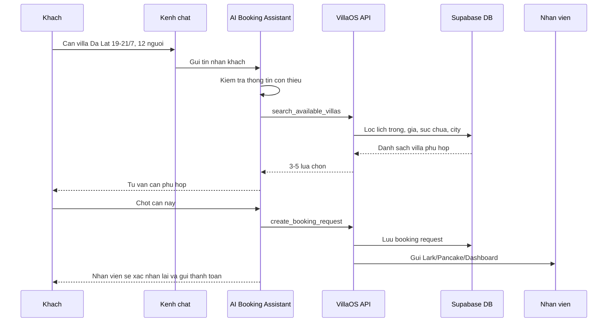

# VillaOS Phase 2 - AI Chatbot Tu Van Booking

## 1. Muc Tieu

Phase 1 dang tap trung lay du lieu tu Google Sheet chu nha thong qua n8n va dong bo ve Supabase/Postgres. Phase 2 se dung bo du lieu nay de xay chatbot tu van booking tren website, Facebook/Pancake va cac kenh khac trong tuong lai.

Muc tieu chinh:

- Khach hoi phong qua website, Facebook, Instagram hoac kenh khac.
- Bot hieu nhu cau: ngay di, so dem, so khach, khu vuc, ngan sach, yeu cau dac biet.
- Bot tim villa phu hop dua tren du lieu trong database.
- Bot tu van 3-5 lua chon tot nhat, noi ro gia, suc chua, ghi chu quan trong.
- Khi khach muon chot, bot tao yeu cau booking cho nhan vien xu ly tiep.
- Nhan vien xac nhan lai voi chu nha, thanh toan, khoa phong.

Nguyen tac quan trong: chatbot khong duoc tu dong xac nhan booking o giai doan dau. Chatbot chi nen tao `booking_request` va ban giao cho nhan vien.

## 2. Nguyen Tac Kien Truc

Supabase/Postgres la trung tam du lieu, nhung AI, Pancake hoac cac kenh chat khong nen doc truc tiep database.

Ly do:

- Can bao ve du lieu noi bo: hoa hong, thong tin chu nha, ghi chu nhay cam.
- Can kiem soat logic loc phong: du lieu cu, ngay can review, so khach, gia, khu vuc.
- Can audit duoc bot da tra loi dua tren du lieu nao.
- Sau nay doi AI, doi Pancake, them Zalo/Website thi khong lam vo logic data.
- Neu cau truc database thay doi, chi can sua backend API, khong phai sua tung bot.

Mo hinh khuyen nghi:



## 3. Vai Tro Tung Thanh Phan

### 3.1 Supabase/Postgres

La nguon du lieu goc cua he thong.

Du lieu chinh:

- `sheet_sources`: danh sach Google Sheet chu nha.
- `properties`: danh sach villa/phong.
- `availability`: lich trong/booked theo ngay.
- `review_queue`: cac dong du lieu can kiem tra.
- `sheet_sync_status`: trang thai dong bo tung sheet.

Can bo sung cho Phase 2:

- `chat_sessions`: moi phien hoi thoai voi khach.
- `chat_messages`: lich su tin nhan.
- `customer_profiles`: thong tin khach va nhu cau.
- `booking_requests`: yeu cau dat phong cho nhan vien xu ly.
- `lead_sources`: nguon khach den tu website, Facebook, Pancake, Zalo.

### 3.2 VillaOS Backend API

Backend la lop kiem soat logic. AI va cac kenh ben ngoai chi duoc goi API da thiet ke san.

API can co:

- `POST /chat/search-villas`: tim villa phu hop.
- `POST /chat/villa-detail`: lay thong tin chi tiet mot villa.
- `POST /chat/create-lead`: tao lead khi khach de lai nhu cau.
- `POST /chat/create-booking-request`: tao yeu cau giu phong.
- `POST /chat/handoff`: ban giao hoi thoai cho nhan vien.
- `GET /chat/session/:id`: xem lai hoi thoai.

Backend phai xu ly:

- Chi tra villa co lich `available`.
- Loai ngay/can dang `needs_review`.
- Kiem tra `last_synced_at`, khong tu van chac neu du lieu qua cu.
- Loc theo city, so khach, gia, so dem, yeu cau dac biet.
- Tra ve thong tin an toan cho khach, khong tra du lieu noi bo.

### 3.3 AI Booking Assistant

AI khong doc DB truc tiep. AI chi goi tool/API:

- `search_available_villas`
- `get_villa_detail`
- `create_booking_request`
- `handoff_to_staff`

AI co nhiem vu:

- Hoi bo sung thong tin neu khach noi chua ro.
- Tom tat nhu cau khach.
- Goi API de tim can phu hop.
- Tu van bang ngon ngu sale tu nhien.
- Khong bia thong tin neu DB khong co.
- Khi khach muon chot, tao booking request va bao nhan vien.

Quy tac an toan:

- Khong noi "da giu phong thanh cong" neu nhan vien chua xac nhan.
- Chi noi "em da gui yeu cau de nhan vien kiem tra lai va xac nhan".
- Neu du lieu lich qua cu, bot phai noi can nhan vien check lai.
- Neu thong tin can thieu, bot phai noi chua co thong tin va ban giao nhan vien.

### 3.4 Website Chat

Nen lam truoc vi de kiem soat va test nhat.

Tinh nang MVP:

- Widget chat tren website.
- Bot hoi nhu cau khach.
- Bot goi API tim villa.
- Bot hien 3-5 lua chon.
- Khach bam chon can quan tam.
- He thong tao booking request.
- Gui thong bao ve Lark hoac dashboard nhan vien.

### 3.5 Pancake/Facebook

Pancake lien quan manh neu kenh ban chinh la Facebook/Instagram.

Co 2 cach tich hop:

**Cach 1: AI tra loi thong qua Pancake**

- Khach nhan Facebook.
- Pancake nhan tin va gui webhook sang VillaOS/n8n.
- VillaOS AI xu ly va goi API tim villa.
- Cau tra loi duoc gui nguoc ve Pancake.

Can dieu kien:

- Pancake co API/webhook on dinh.
- Co co che tat/bat auto reply.
- Co co che ban giao nhan vien.

**Cach 2: AI ho tro nhan vien**

- Pancake van la inbox chinh.
- AI chi goi y villa/cau tra loi cho nhan vien.
- Nhan vien bam gui hoac copy gui.

Khuyen nghi giai doan dau: dung Cach 2 de giam rui ro. Khi du lieu va prompt on dinh moi bat auto reply tung phan.

### 3.6 Lark

Lark nen dung cho van hanh noi bo.

Use case:

- Thong bao booking request moi.
- Thong bao khach can nhan vien tu van.
- Thong bao n8n sync loi.
- Thong bao sheet stale, lau chua cap nhat.
- Tao task cho nhan vien sale.
- Luu nut thao tac noi bo: da goi khach, da gui coc, da xac nhan, het phong.

Lark khong nen la database chinh.

## 4. Luong Tu Van Booking



## 5. Booking Request

Can them bang `booking_requests` de quan ly viec chot phong.

Trang thai de xuat:

- `new`: moi tao lead hoac moi co nhu cau.
- `qualified`: da co du thong tin co ban.
- `pending_staff`: khach muon chot, cho nhan vien xu ly.
- `checking_owner`: nhan vien dang check lai voi chu nha.
- `payment_pending`: da gui thong tin thanh toan/coc.
- `confirmed`: da xac nhan dat phong.
- `cancelled`: khach huy.
- `unavailable`: can da het phong hoac khong phu hop.

Thong tin can luu:

- Khach den tu kenh nao.
- Ngay check-in/check-out.
- So khach.
- Villa khach quan tam.
- Gia bot da tu van.
- Link hoi thoai neu co.
- Nhan vien phu trach.
- Trang thai xu ly.
- Ghi chu noi bo.

## 6. Data Contract Cho AI

AI chi nen nhan du lieu da loc, ngan gon, an toan.

Vi du response tu `search-villas`:

```json
{
  "query": {
    "city": "dalat",
    "checkIn": "2026-07-19",
    "checkOut": "2026-07-21",
    "guests": 12
  },
  "dataFreshness": {
    "status": "fresh",
    "lastSyncedAt": "2026-06-24T08:30:00Z"
  },
  "results": [
    {
      "propertyId": "prop_123",
      "name": "VAN THANH FLEUR VILLAGE",
      "city": "dalat",
      "maxGuests": 34,
      "pricePerNight": 8000000,
      "totalPrice": 16000000,
      "availableDates": ["2026-07-19", "2026-07-20"],
      "notesForGuest": ["Khong karaoke", "Phu thu neu vuot so khach"],
      "sourceFreshness": "fresh"
    }
  ]
}
```

AI khong can nhan:

- Hoa hong noi bo neu khong can.
- Credential Google Sheet.
- Cau truc parser/n8n.
- Raw availability cua tat ca ngay.
- Ghi chu noi bo nhay cam.

## 7. Roadmap De Xuat

### Phase 2.1 - Chat Search API

Muc tieu: co API tim villa dang tin cay truoc khi lam UI chat.

Cong viec:

- Tao endpoint `POST /chat/search-villas`.
- Loc theo city, ngay, so khach, budget.
- Loai data `needs_review`.
- Canh bao neu data stale.
- Viet test voi data Phase 1.

Ket qua can dat:

- Co the goi API va nhan danh sach villa phu hop.
- Ket qua trung voi lich trong DB.
- Khong tra du lieu noi bo nguy hiem.

### Phase 2.2 - Booking Request API

Muc tieu: khi khach muon chot, he thong tao request cho nhan vien.

Cong viec:

- Tao bang `booking_requests`.
- Tao endpoint `POST /chat/create-booking-request`.
- Gan source: website, Facebook, Pancake.
- Gui thong bao Lark.
- Hien request tren dashboard.

Ket qua can dat:

- Bot/website tao duoc booking request.
- Nhan vien nhan thong bao va xu ly duoc.

### Phase 2.3 - Website Chat MVP

Muc tieu: test chatbot tren website truoc.

Cong viec:

- Them chat widget.
- AI hoi nhu cau va goi search API.
- Hien 3-5 can phu hop.
- Nut "can nhan vien tu van" hoac "giu can nay".
- Luu chat session.

Ket qua can dat:

- Khach hoi phong tren website va nhan tu van tu DB that.
- Nhan vien nhan request khi khach muon chot.

### Phase 2.4 - Pancake/Facebook Assistant

Muc tieu: dua AI vao kenh co khach that nhung co kiem soat.

Cong viec:

- Kiem tra API/webhook Pancake.
- Dong bo message tu Pancake ve VillaOS.
- AI goi y cau tra loi cho nhan vien.
- Gan tag/ghi chu vao Pancake neu API cho phep.
- Sau khi on dinh moi bat auto reply mot phan.

Ket qua can dat:

- Nhan vien trong Pancake co goi y villa/cau tra loi.
- Co the handoff ro rang giua bot va nguoi.

### Phase 2.5 - Multi Channel

Muc tieu: mo rong ra cac kenh khac khong lam vo logic.

Kenh tiem nang:

- Zalo
- Instagram
- WhatsApp
- Lark form noi bo
- Partner portal/API

Nguyen tac:

- Kenh nao cung goi VillaOS Backend API.
- Khong kenh nao doc DB truc tiep.
- Moi kenh chi la adapter giao tiep.

## 8. Tich Hop Voi n8n

n8n tiep tuc phu trach Phase 1:

- Doc Google Sheet.
- Parse lich.
- Upsert properties/availability.
- Ghi sync status.

Trong Phase 2, n8n co the dung them cho:

- Gui Lark notification.
- Nhan webhook tu Pancake neu backend chua tich hop truc tiep.
- Tao flow canh bao data stale.
- Tao flow daily summary cho nhan vien.

Khong nen de n8n la noi xu ly logic AI phuc tap dai han. Logic cot loi nen nam trong backend de de test, versioning va bao tri.

## 9. Rui Ro Va Cach Giam Rui Ro

### Rui ro 1: Du lieu Google Sheet cham hoac sai

Cach xu ly:

- API tra kem `lastSyncedAt`.
- Neu du lieu qua cu, bot can noi can nhan vien xac nhan lai.
- Khong cho bot confirmed booking.

### Rui ro 2: AI tu van sai vi thieu thong tin

Cach xu ly:

- AI chi noi theo field backend tra ve.
- Neu thieu thong tin, bot noi chua co thong tin.
- Prompt cam bot bia tien ich/gia/chinh sach.

### Rui ro 3: Pancake/Facebook co khach that, sai se anh huong doanh thu

Cach xu ly:

- Bat dau bang AI ho tro nhan vien, chua auto reply.
- Auto reply chi bat cho cau hoi don gian.
- Luon co nut handoff cho nhan vien.

### Rui ro 4: Lo du lieu noi bo

Cach xu ly:

- AI khong truy cap DB truc tiep.
- API chi tra field an toan.
- Tach `notesForGuest` va `internalNotes`.

## 10. Baseline Quyet Dinh

Quyet dinh hien tai cho Phase 2:

- Supabase/Postgres tiep tuc la trung tam du lieu.
- VillaOS Backend API la lop bat buoc giua DB va AI/kenh chat.
- Website chat lam truoc de test logic.
- Pancake/Facebook lam sau, uu tien AI ho tro nhan vien truoc khi auto reply.
- Lark dung cho thong bao va van hanh noi bo.
- Chatbot chi tao `booking_request`, khong tu dong xac nhan booking.

## 11. Cau Hoi Can Chot Truoc Khi Implement

- Website chat se gan vao website nao truoc?
- Pancake co API/webhook nao dang dung duoc khong?
- Bot co duoc bao gia final cho khach khong, hay chi bao gia tham khao?
- Muc stale data la bao lau: 30 phut, 2 gio, hay 1 ngay?
- Khi mot villa co `needs_review`, bot nen an hoan toan hay bao "can nhan vien check"?
- Ai la nhan vien/nhom Lark nhan booking request?

