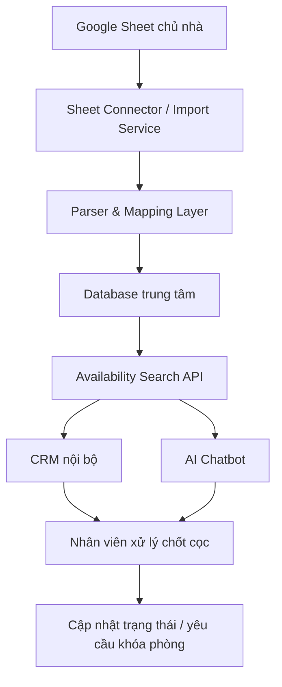

# Giải Pháp Quản Trị Booking Villa Cho Agency

## 1. Bối Cảnh

Agency đang bán phòng/villa cho nhiều chủ nhà tại Việt Nam. Mỗi chủ nhà thường chia sẻ một hoặc nhiều file Google Sheet để agency kiểm tra lịch trống, lịch đã đặt, giá theo ngày, sức chứa, phụ thu và các ghi chú vận hành.

Hiện tại agency có khoảng 50 chủ nhà. Mỗi chủ nhà có cách trình bày Google Sheet khác nhau:

- Có sheet chia theo từng tháng.
- Có sheet tô màu đỏ cho ngày đã đặt.
- Có sheet đặt villa/căn theo cột và ngày theo hàng.
- Có sheet có giá, trạng thái booking, ghi chú và thông tin phụ thu nằm lẫn trong ô.
- Có sheet riêng cho thông tin khách sạn/villa.

Vì dữ liệu phân mảnh và không đồng nhất, nhân viên phải kiểm tra thủ công từng file khi khách hỏi phòng qua Facebook, Instagram, website hoặc các kênh khác.

## 2. Nỗi Đau Chính

### 2.1. Dữ Liệu Phân Mảnh

Dữ liệu booking nằm trong nhiều Google Sheet khác nhau, thuộc nhiều chủ nhà khác nhau. Agency không có một nơi tập trung để tìm kiếm tình trạng phòng.

### 2.2. Format Sheet Không Đồng Nhất

Mỗi chủ nhà tự thiết kế sheet theo cách riêng. Điều này khiến việc tự động đọc dữ liệu khó hơn so với một hệ thống booking chuẩn.

Ví dụ:

- Có sheet dùng màu đỏ để thể hiện đã book.
- Có sheet dùng chữ ghi chú như "Bảo trì", "Nệm", "Cọc", "Giữ phòng".
- Có sheet để giá và trạng thái trong cùng một ô.
- Có sheet chia từng tháng thành từng tab.

### 2.3. Dữ Liệu Thay Đổi Liên Tục

Một chủ nhà có thể làm việc với nhiều agency khác nhau. Vì vậy lịch phòng trên Google Sheet có thể thay đổi thường xuyên khi các agency khác chốt khách.

### 2.4. Quy Trình Tư Vấn Chậm Và Dễ Sai

Khi khách hỏi, nhân viên phải:

1. Hỏi ngày đi, số lượng khách, nhu cầu.
2. Mở nhiều Google Sheet.
3. Kiểm tra từng villa/căn.
4. Đọc giá, sức chứa, phụ thu, ghi chú.
5. Tư vấn lại cho khách.

Quy trình này tốn thời gian, khó scale và dễ bỏ sót phòng phù hợp.

### 2.5. Chatbot Không Thể Hoạt Động Tốt Nếu Chưa Chuẩn Hóa Dữ Liệu

AI chatbot không nên đọc trực tiếp 50 Google Sheet không đồng nhất. Nếu dữ liệu chưa được chuẩn hóa, chatbot dễ tư vấn sai lịch trống, sai giá hoặc sai điều kiện booking.

## 3. Nguyên Tắc Giải Pháp

Không nên giải bài toán bằng cách để chatbot đọc trực tiếp từng Google Sheet.

Giải pháp đúng là xây một lớp dữ liệu trung tâm, đóng vai trò trung gian giữa Google Sheet của chủ nhà và các kênh bán hàng.

Mục tiêu là biến dữ liệu không đồng nhất thành một hệ thống chuẩn, có thể truy vấn được:

- Villa/căn nào?
- Ngày nào?
- Còn trống hay đã đặt?
- Giá bao nhiêu?
- Sức chứa bao nhiêu?
- Có phụ thu không?
- Có yêu cầu số đêm tối thiểu không?
- Có ghi chú vận hành nào không?
- Dữ liệu lấy từ sheet nào?
- Cập nhật lần cuối lúc nào?

## 4. Kiến Trúc Tổng Thể



Hệ thống nên gồm 6 phần chính:

1. Google Sheet Connector.
2. Parser và Mapping Layer.
3. Database trung tâm.
4. CRM nội bộ cho nhân viên.
5. Availability Search API.
6. AI chatbot tư vấn khách.

## 5. Google Sheet Connector

Google Sheet Connector là service dùng để kết nối tới Google Sheets API và đọc dữ liệu từ các file Google Sheet của chủ nhà.

### 5.1. Chế Độ Cập Nhật

Nên hỗ trợ 2 chế độ:

- Cập nhật tự động định kỳ: ví dụ mỗi 5 phút, 15 phút hoặc 30 phút.
- Cập nhật thủ công: nhân viên bấm nút "Đồng bộ ngay" khi cần kiểm tra dữ liệu mới nhất.

### 5.2. Không Sửa Sheet Gốc

Hệ thống chỉ nên đọc dữ liệu từ Google Sheet của chủ nhà, không nên sửa trực tiếp vào sheet gốc.

Lý do:

- Tránh làm hỏng dữ liệu của chủ nhà.
- Tránh xung đột với agency khác.
- Dễ kiểm soát trách nhiệm dữ liệu.
- Có thể lưu snapshot để đối chiếu khi có tranh chấp.

### 5.3. Metadata Cần Quản Lý

Mỗi Google Sheet nên được lưu thông tin:

```text
Owner
Tên chủ nhà
Google Sheet URL
Danh sách villa/căn
Template parser đang dùng
Thời điểm sync cuối
Trạng thái sync: thành công / lỗi / cần kiểm tra
Người phụ trách nội bộ
```

## 6. Parser Và Mapping Layer

Đây là phần quan trọng nhất của hệ thống.

Vì Google Sheet của các chủ nhà không giống nhau, không nên viết một parser duy nhất cho tất cả. Nên xây theo mô hình template parser.

### 6.1. Template Parser

Mỗi nhóm sheet có cấu trúc giống nhau sẽ dùng một template parser riêng.

Ví dụ:

- Template A: ngày nằm ở cột A/B, villa nằm theo cột ngang.
- Template B: mỗi tháng là một tab riêng.
- Template C: ô đỏ là đã đặt, ô trắng là còn trống, ô xanh là giá đặc biệt.
- Template D: thông tin villa nằm phía trên, lịch booking nằm phía dưới.

### 6.2. Cấu Hình Mapping

Với mỗi chủ nhà hoặc mỗi sheet, agency nên cấu hình mapping một lần:

```text
Sheet tab tháng nằm ở đâu
Dòng chứa ngày
Cột chứa villa/căn
Cách nhận biết booked
Cách nhận biết available
Cách lấy giá
Cách lấy sức chứa
Cách lấy phụ thu
Cách lấy ghi chú
Cách nhận biết dữ liệu bất thường
```

### 6.3. Dữ Liệu Chuẩn Sau Khi Parse

Kết quả cuối cùng phải được chuẩn hóa về một cấu trúc chung:

```json
{
  "property_id": "villa_001",
  "property_name": "Me Bap Homestay - Can 6 Pax",
  "date": "2026-06-20",
  "status": "available",
  "price": 2200000,
  "capacity_standard": 6,
  "capacity_max": 8,
  "extra_fee_note": "Phụ thu 100k/người",
  "min_nights": 1,
  "source_sheet": "google_sheet_url",
  "last_synced_at": "2026-06-11T10:30:00"
}
```

### 6.4. Không Để AI Tự Đoán Dữ Liệu Booking

Nếu parser không chắc chắn một ô là booked, available hay ghi chú, hệ thống nên đánh dấu là `unknown` hoặc `needs_review`.

Không nên để AI tự đoán trạng thái phòng trong các trường hợp dữ liệu không rõ ràng.

## 7. Database Trung Tâm

Agency cần một database riêng để lưu dữ liệu đã chuẩn hóa. Không nên phụ thuộc vào Google Sheet khi tìm kiếm phòng cho khách.

### 7.1. Các Bảng Chính

```text
owners
properties
property_units
availability_calendar
pricing_rules
booking_requests
sync_logs
staff_users
customer_conversations
```

### 7.2. Bảng Availability Calendar

Bảng quan trọng nhất là `availability_calendar`.

Ví dụ cấu trúc:

```text
property_id
unit_id
date
status: available / booked / blocked / unknown
price
min_nights
capacity_standard
capacity_max
note
source_sheet_url
source_updated_at
synced_at
confidence_score
```

### 7.3. Vì Sao Cần Database Quan Hệ

Lịch trống, giá và trạng thái booking là dữ liệu cần truy vấn chính xác theo ngày. Vì vậy nên dùng PostgreSQL hoặc một database quan hệ tương đương.

Không nên lưu dữ liệu availability chính trong vector database, vì vector database phù hợp cho tìm kiếm ngữ nghĩa, không phù hợp làm nguồn sự thật cho lịch trống và giá.

## 8. CRM Nội Bộ Cho Nhân Viên

Trước khi làm chatbot, nên xây một CRM nội bộ để nhân viên sử dụng.

Mục tiêu giai đoạn đầu là giảm thời gian tra Google Sheet thủ công.

### 8.1. Tính Năng Cần Có

- Tìm villa còn trống theo ngày check-in/check-out.
- Lọc theo số lượng khách.
- Lọc theo khu vực.
- Lọc theo khoảng giá.
- Lọc theo sức chứa.
- Xem giá từng ngày.
- Xem phụ thu và ghi chú.
- Xem nguồn dữ liệu từ Google Sheet.
- Xem thời điểm dữ liệu được sync lần cuối.
- Bấm nút "Sync ngay".
- Tạo yêu cầu giữ phòng.
- Quản lý trạng thái khách hàng.

### 8.2. Workflow Cho Nhân Viên

```text
Khách hỏi phòng
-> Nhân viên nhập ngày + số khách + nhu cầu
-> Hệ thống trả danh sách villa phù hợp
-> Nhân viên tư vấn khách
-> Khách chọn căn
-> Tạo booking request
-> Nhân viên xác nhận lại với chủ nhà
-> Khách chuyển cọc
-> Nhân viên cập nhật trạng thái
```

### 8.3. Trạng Thái Booking Request

Nên quản lý các trạng thái:

```text
new
consulting
waiting_for_customer
waiting_for_owner_confirmation
waiting_for_deposit
deposit_received
confirmed
cancelled
lost
```

## 9. Availability Search API

Availability Search API là bộ não tìm phòng của hệ thống.

API này sẽ được dùng bởi:

- CRM nội bộ.
- AI chatbot.
- Website.
- Các kênh bán hàng khác trong tương lai.

### 9.1. Các Câu Hỏi API Cần Trả Lời

```text
Ngày 20-22/6 còn villa nào cho 10 khách?
Villa nào dưới 4 triệu/đêm ở Ba Vì?
Căn nào nhận thú cưng?
Căn nào không karaoke?
Có căn nào còn trống cuối tuần này cho 15 người?
Có căn nào phù hợp nhóm gia đình có trẻ nhỏ?
```

### 9.2. Logic Tìm Kiếm

API cần kiểm tra:

- Tất cả ngày trong khoảng check-in/check-out đều còn trống.
- Sức chứa phù hợp.
- Số đêm tối thiểu phù hợp.
- Giá phù hợp ngân sách.
- Không vi phạm ghi chú hoặc quy định.
- Dữ liệu vẫn còn mới.
- Trạng thái không phải `unknown` hoặc `needs_review`.

### 9.3. Xử Lý Dữ Liệu Cũ

Nếu dữ liệu đã lâu chưa sync, hệ thống không nên khẳng định chắc chắn.

Ví dụ nếu dữ liệu đã hơn 2 tiếng chưa được cập nhật, chatbot hoặc CRM nên hiển thị:

```text
Dữ liệu lịch phòng được cập nhật lần cuối lúc 09:30. Cần kiểm tra lại trước khi xác nhận giữ phòng.
```

## 10. AI Chatbot

Chatbot nên hoạt động trên dữ liệu đã chuẩn hóa, không đọc trực tiếp Google Sheet.

### 10.1. Vai Trò Của Chatbot

Chatbot có thể:

- Hỏi nhu cầu khách.
- Xác định ngày đi, số khách, khu vực, ngân sách.
- Gọi Availability Search API.
- Gợi ý 3-5 villa phù hợp.
- Giải thích giá, sức chứa, phụ thu, quy định.
- Thu thập thông tin khách.
- Tạo lead hoặc booking request cho nhân viên.

### 10.2. Giới Hạn Của Chatbot

Ở giai đoạn đầu, chatbot không nên tự khóa phòng hoặc xác nhận booking cuối cùng.

Chatbot nên được phép:

- Tư vấn.
- Đề xuất phòng.
- Báo tình trạng còn trống theo dữ liệu mới nhất.
- Tạo yêu cầu giữ phòng.

Chatbot không nên được phép:

- Tự xác nhận giữ phòng cuối cùng.
- Tự cam kết phòng chắc chắn còn nếu chưa xác nhận với chủ nhà.
- Tự xử lý thanh toán nếu quy trình vận hành chưa sẵn sàng.

### 10.3. Câu Chốt Nên Dùng

```text
Em đã ghi nhận yêu cầu giữ căn này. Nhân viên sẽ kiểm tra lần cuối với chủ nhà và liên hệ anh/chị để xác nhận cọc.
```

## 11. Lộ Trình Triển Khai

### Giai Đoạn 1: MVP Nội Bộ

Mục tiêu: giảm thời gian tra sheet thủ công.

Việc cần làm:

- Import 5-10 Google Sheet mẫu.
- Xây parser cho 2-3 format phổ biến nhất.
- Thiết kế database availability.
- Xây trang tìm phòng nội bộ.
- Có nút sync thủ công.
- Có log lỗi parser.

Ở giai đoạn này chưa cần chatbot phức tạp.

### Giai Đoạn 2: Chuẩn Hóa 50 Chủ Nhà

Mục tiêu: đưa toàn bộ nguồn hàng vào hệ thống.

Việc cần làm:

- Màn hình cấu hình mapping cho từng sheet.
- Sync tự động định kỳ.
- Cảnh báo khi sheet đổi cấu trúc.
- Dashboard dữ liệu lỗi hoặc cần kiểm tra.
- Quản lý thông tin villa: ảnh, sức chứa, tiện ích, quy định, giá phụ thu.
- Tìm kiếm nâng cao cho nhân viên sale.

### Giai Đoạn 3: AI Chatbot Tư Vấn

Mục tiêu: tự động hóa phần tư vấn đầu phễu.

Việc cần làm:

- Tích hợp chatbot website.
- Tích hợp Facebook Messenger nếu phù hợp.
- Tích hợp Instagram DM nếu có API hoặc phần mềm trung gian.
- Tích hợp Zalo OA nếu cần.
- Kết nối chatbot với Availability Search API.
- Tạo lead/booking request trong CRM.

### Giai Đoạn 4: Scale Vận Hành

Mục tiêu: tăng số chủ nhà, tăng số kênh bán và giảm phụ thuộc nhân sự.

Việc cần làm:

- Scoring villa theo tỷ lệ chốt.
- Gợi ý căn thay thế khi hết phòng.
- Báo cáo doanh thu và hoa hồng.
- SLA cho đồng bộ dữ liệu.
- Phân quyền nhân viên.
- Lịch sử hội thoại khách.
- Tự động nhắc khách chuyển cọc.
- Tự động nhắc nhân viên xác nhận với chủ nhà.

## 12. Công Nghệ Đề Xuất

Một stack thực tế có thể dùng:

```text
Frontend/Admin: Next.js hoặc React
Backend API: Node.js/NestJS hoặc Python/FastAPI
Database: PostgreSQL
Queue sync: BullMQ / Celery / Cloud Tasks
Google Sheet API: Google OAuth / Service Account
AI chatbot: OpenAI API hoặc agent có tool calling
Vector search: dùng cho mô tả villa, không dùng làm nguồn sự thật cho lịch trống
Hosting: Vercel + Railway/Render/Fly.io/AWS/GCP
```

### 12.1. Lưu Ý Về Vector Database

Vector database chỉ nên dùng cho:

- Tìm kiếm mô tả villa.
- Tìm tiện ích theo ngôn ngữ tự nhiên.
- Tìm quy định hoặc ghi chú dài.
- Hỗ trợ chatbot hiểu ngữ cảnh.

Không nên dùng vector database làm nguồn chính cho:

- Lịch trống.
- Giá theo ngày.
- Trạng thái đã book.
- Điều kiện check-in/check-out.

Các dữ liệu này cần nằm trong PostgreSQL hoặc database quan hệ tương đương.

## 13. Rủi Ro Và Cách Kiểm Soát

### 13.1. Rủi Ro Sheet Đổi Format

Chủ nhà có thể tự thay đổi cấu trúc sheet.

Cách kiểm soát:

- Lưu template mapping.
- Detect khi số cột/dòng thay đổi bất thường.
- Cảnh báo sync lỗi.
- Đưa sheet vào trạng thái cần kiểm tra.

### 13.2. Rủi Ro Dữ Liệu Không Rõ Ràng

Một ô có thể vừa chứa giá, vừa chứa ghi chú, vừa có màu nền.

Cách kiểm soát:

- Dùng rule parser theo từng template.
- Có trạng thái `unknown`.
- Có confidence score.
- Không cho chatbot khẳng định nếu dữ liệu không chắc.

### 13.3. Rủi Ro Booking Trùng

Do nhiều agency cùng bán, dữ liệu có thể thay đổi ngay sau khi khách hỏi.

Cách kiểm soát:

- Sync thường xuyên.
- Cho nhân viên bấm sync ngay trước khi chốt.
- Booking cuối cùng cần xác nhận với chủ nhà.
- Lưu timestamp dữ liệu khi tư vấn khách.

### 13.4. Rủi Ro Chatbot Tư Vấn Sai

Nếu chatbot được trao quyền quá nhiều, có thể cam kết sai.

Cách kiểm soát:

- Chatbot chỉ tư vấn và tạo request.
- Nhân viên xác nhận bước cuối.
- Chatbot luôn nói rõ dữ liệu được cập nhật lúc nào.
- Không cho chatbot tự suy luận lịch trống ngoài API.

## 14. KPI Nên Theo Dõi

Agency nên đo các chỉ số:

- Thời gian trung bình để tìm phòng phù hợp.
- Tỷ lệ phản hồi khách trong 5 phút đầu.
- Tỷ lệ chuyển đổi từ khách hỏi sang đặt cọc.
- Số booking bị trùng hoặc sai thông tin.
- Tỷ lệ sheet sync thành công.
- Số sheet cần kiểm tra thủ công.
- Doanh thu theo chủ nhà.
- Hoa hồng theo kênh bán.
- Hiệu suất từng nhân viên sale.

## 15. Kết Luận

Giải pháp tốt nhất là xây một Booking Data Hub cho agency.

Hệ thống này sẽ:

- Đồng bộ dữ liệu từ Google Sheet của chủ nhà.
- Chuẩn hóa lịch trống, giá, sức chứa và ghi chú.
- Tạo database trung tâm làm nguồn sự thật.
- Cung cấp CRM nội bộ cho nhân viên.
- Cung cấp API cho chatbot và website.
- Giảm thời gian tra cứu thủ công.
- Giảm rủi ro tư vấn sai.
- Giúp agency scale từ 50 chủ nhà lên 200-500 chủ nhà.

Chatbot chỉ là lớp giao tiếp bên ngoài. Tài sản cốt lõi của agency là database availability tập trung, có dữ liệu sạch, cập nhật thường xuyên và có thể truy vấn chính xác.
