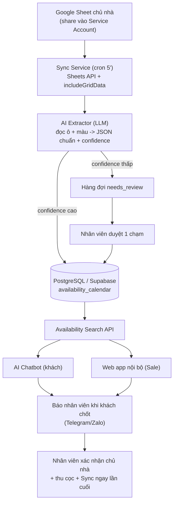

# Giải Pháp Quản Trị & Scale Booking Villa — Bản v3 (Hợp Nhất)

> Bản này hợp nhất 2 giải pháp trước, **bỏ n8n**, dựa trên **dữ liệu thật** từ 3 sheet chủ nhà đã kiểm tra, và tối ưu cho 2 ràng buộc quan trọng nhất của agency:
> 1. **Ổn định** — ít bộ phận động, ít chỗ hỏng.
> 2. **Dễ vận hành** — nhân viên không rành công nghệ vẫn dùng được.
>
> **Không cần real-time.** Đồng bộ định kỳ (mặc định 5 phút) + nút "Đồng bộ ngay" là đủ.

---

## 1. Tóm tắt nỗi đau & nguyên tắc

Agency bán phòng cho ~50 chủ nhà. Mỗi chủ nhà chỉ dùng Google Sheet, format khác nhau, thay đổi liên tục (nhiều agency cùng bán). Nhân viên phải mở từng sheet để tra lịch khi khách hỏi → chậm, dễ sai, không scale.

**Nguyên tắc cốt lõi (cả 2 bản trước đều đồng thuận, giữ nguyên):**

- Xây **một lớp dữ liệu trung tâm** (Booking Data Hub). **Không** để chatbot đọc thẳng Google Sheet.
- **Database quan hệ (PostgreSQL) là nguồn sự thật** cho lịch/giá. Vector DB chỉ dùng cho mô tả/tiện ích, **không** dùng cho lịch trống.
- Chatbot **chỉ tư vấn + tạo yêu cầu**, không tự khóa phòng. **Bước chốt cuối luôn xác nhận lại với chủ nhà.**
- Dữ liệu không chắc → đánh dấu `needs_review`, **không đoán bừa**.

---

## 2. Phát hiện từ dữ liệu thật (đã kiểm tra 3 sheet)

Đây là phần quyết định lựa chọn công nghệ. 3 sheet đã đọc:

| Sheet | Cấu trúc thật | Trạng thái booked mã hóa bằng |
|---|---|---|
| Mẹ Bắp Homestay | Mỗi tháng 1 tab, **format khác nhau giữa các tab**, file 113MB (nhiều tab cũ + ảnh) | **Tên khách thay cho giá** + **tô màu đỏ** |
| Hoàng Cường | Tab đầu là danh mục villa; lịch nằm ở **các sheet con, link lồng trong ô** | Phải mở sheet con |
| The Peace Seeker | Mỗi tháng 1 tab, header mô tả dài, giá dạng **"7tr/7tr5", "3tr/3tr5/4tr5"** | **CHỈ bằng màu nền** (xanh = trống / Có Khách / Tạm Giữ) |

**4 kết luận kỹ thuật bắt buộc:**

1. **Trạng thái còn/hết phòng nằm chủ yếu ở MÀU NỀN ô.** Xuất CSV/text thông thường **mất hết màu**. → Bắt buộc đọc qua **Google Sheets API `spreadsheets.get` + `includeGridData=true`** để lấy `backgroundColor` từng ô.
2. **Format đổi ngay trong cùng 1 file** (giữa các tab) → **không thể** viết parser code cứng cho từng kiểu (sẽ bảo trì vô tận). Phải dùng **AI/LLM để "hiểu" ô**.
3. **1 chủ nhà có thể = nhiều sheet lồng nhau** → số sheet thực tế nhiều hơn 50. Hệ thống phải dò và quản lý cả sheet con.
4. **Giá ghi kiểu người đọc** ("7tr/7tr5", "10.000.000 đ", nhiều loại phòng trong 1 ô) → cần AI chuẩn hóa, code regex thuần sẽ sai.

**Phạm vi dữ liệu:** chỉ đọc **tháng hiện tại trở đi** (mặc định hôm nay + 6 tháng tới). Bỏ toàn bộ tab/ngày quá khứ và ảnh → giảm tải, tăng độ chính xác, né bẫy "format tab cũ khác tab mới".

---

## 3. Quyết định công nghệ chốt: KHÔNG dùng n8n

Phần khó nhất (đọc màu, bóc giá "7tr/7tr5", gọi LLM) **dù sao cũng phải viết code**. Nhét code vào n8n thì mất lợi "no-code" mà vẫn phải nuôi thêm 1 server n8n → tăng rủi ro hỏng. Vì vậy:

> **Một backend nhỏ (Node.js hoặc Python) + Supabase (PostgreSQL) + nền tảng hosting managed (Render/Railway/Fly).** Đồng bộ bằng cron. Nhân viên chỉ thấy 1 web app đơn giản.

Lợi ích đúng với mục tiêu:
- **Ít bộ phận động nhất** → ổn định hơn. Không ai phải làm sysadmin (nền tảng managed tự khởi động lại khi lỗi).
- Logic khó viết thẳng trong code, không bị gò vào node.
- Nhân viên chỉ tương tác web app → không cần biết công nghệ.

> Lưu ý trung thực: dù chọn cách nào vẫn **cần 1 lập trình viên để xây**. Khác biệt là sau khi xây xong **ít thứ phải canh hơn**.

---

## 4. Kiến trúc tổng thể



6 thành phần:
1. **Sync Service** — cron đọc Google Sheets API (kèm màu) định kỳ + webhook "Sync ngay".
2. **AI Extractor** — LLM bóc tách ô + màu → JSON chuẩn, gắn confidence.
3. **PostgreSQL (Supabase)** — nguồn sự thật cho lịch/giá.
4. **Availability Search API** — bộ não tìm phòng, dùng chung cho web nội bộ + chatbot.
5. **Web app nội bộ** — nhân viên tra phòng, duyệt `needs_review`, quản booking.
6. **AI Chatbot** — tư vấn đầu phễu (giai đoạn sau).

---

## 5. Sync Service (đọc dữ liệu)

### 5.1. Cơ chế
- **Định kỳ:** cron mặc định **5 phút/lần** (cấu hình được: 5/15/30'). Không cần real-time.
- **Thủ công:** nút **"Đồng bộ ngay"** cho nhân viên bấm trước khi chốt khách.
- **Chỉ đọc, không sửa sheet gốc.** Lưu snapshot mỗi lần sync để đối chiếu khi tranh chấp.

### 5.2. Đọc màu (bắt buộc)
- Dùng `spreadsheets.get?includeGridData=true` để lấy `effectiveFormat.backgroundColor` từng ô.
- Mỗi chủ nhà có **bảng nghĩa màu** riêng (vd đỏ = booked, xanh = trống) → lưu trong cấu hình mapping, **không hard-code chung**.

### 5.3. Lọc phạm vi
- Chỉ giữ **tab/ngày >= tháng hiện tại** (cửa sổ trượt: hôm nay + 6 tháng).
- Bỏ qua tab ảnh và tab cũ.
- Tab không nhận diện được tháng → đẩy `needs_review`, không tự đoán.

### 5.4. Dò sheet con
- Khi gặp ô chứa link `docs.google.com/spreadsheets/...` (như Hoàng Cường) → tự thêm sheet con vào danh sách sync.

### 5.5. Truy cập
- Tạo **1 Service Account / tài khoản Google chuyên dụng**. Chủ nhà share sheet vào đó.
- **Không** phụ thuộc tài khoản cá nhân của nhân viên.

---

## 6. AI Extractor (trái tim hệ thống)

Thay vì viết parser code cứng cho từng format (cách 2 bản trước đề xuất — bất khả thi với dữ liệu thật), dùng **LLM để đọc ô**.

### 6.1. Đầu vào cho LLM (mỗi sheet)
- Giá trị text của vùng lịch (đã lọc tháng tương lai).
- **Màu nền từng ô** (từ Sheets API).
- **Bảng nghĩa màu + nghĩa ký hiệu** của chủ nhà đó (cấu hình 1 lần).

### 6.2. Đầu ra chuẩn
```json
{
  "property_id": "mebap_soulmate",
  "property_name": "Soulmate - Hoàng Hoa Thám",
  "date": "2026-06-20",
  "status": "available",        // available | booked | blocked | unknown
  "price": 1300000,
  "capacity_standard": 6,
  "capacity_max": 8,
  "extra_fee_note": "Phụ thu 100k/người/đêm",
  "min_nights": 1,
  "rules": ["không loa kéo", "nhận thú cưng"],
  "source_sheet_url": "...",
  "source_tab": "Tháng 6",
  "confidence": 0.93,
  "last_synced_at": "2026-06-11T10:30:00"
}
```

### 6.3. AI xử lý được các ca khó thực tế
- Giá "7tr/7tr5", "3tr/3tr5/4tr5" → tách đúng theo loại phòng.
- Ô chứa **tên khách thay cho giá** → hiểu là `booked`.
- Ô **màu đỏ** dù có giá → `booked`.
- Chữ "MB", "Tạm Giữ", "Cọc", "Bảo trì" → map về `blocked`/`booked` theo bảng nghĩa.

### 6.4. Kỷ luật an toàn (quan trọng)
- Mỗi bản ghi có **confidence**.
- `confidence < ngưỡng` HOẶC màu/ký hiệu lạ → **không ghi "available"**, đẩy vào **hàng `needs_review`**.
- **Tuyệt đối không để AI tự khẳng định "còn phòng" khi không chắc.** Thà bỏ sót còn hơn báo nhầm → tránh đặt trùng.

---

## 7. Database (Supabase / PostgreSQL)

### 7.1. Bảng chính
```
owners            -- chủ nhà, hoa hồng, liên hệ
properties        -- villa/căn: tên, sức chứa, tiện ích, rules, ảnh
sheets            -- mỗi sheet/sheet con + mapping màu + người phụ trách
availability_calendar  -- bảng quan trọng nhất
booking_requests  -- yêu cầu giữ phòng + trạng thái
review_queue      -- ô cần nhân viên duyệt
sync_logs         -- lịch sử + lỗi sync
staff_users       -- nhân viên + phân quyền
conversations     -- hội thoại khách (giai đoạn chatbot)
```

### 7.2. availability_calendar
```
property_id, unit_id, date,
status (available/booked/blocked/unknown),
price, min_nights, capacity_standard, capacity_max,
note, rules,
source_sheet_url, source_tab, source_updated_at, synced_at,
confidence
```

### 7.3. Vì sao quan hệ chứ không vector
Lịch/giá cần truy vấn chính xác theo ngày → PostgreSQL. Vector DB chỉ cho tìm mô tả ("villa có hồ bơi cho nhóm gia đình") — **không** làm nguồn sự thật lịch trống.

---

## 8. Availability Search API

Dùng chung cho web nội bộ, chatbot, website tương lai. Trả lời được:
- "20–22/6 còn villa nào cho 10 khách?"
- "Villa nào dưới 4tr/đêm, nhận thú cưng?"
- "Cuối tuần này còn căn 15 người không?"

Logic kiểm tra: **mọi ngày trong khoảng đều `available`** + sức chứa + min_nights + ngân sách + rules + **dữ liệu còn mới** + status không phải `unknown/needs_review`.

**Xử lý dữ liệu cũ:** nếu sync gần nhất đã lâu (vd > 2 giờ), kết quả kèm cảnh báo:
> "Lịch cập nhật lúc 09:30. Cần kiểm tra lại với chủ nhà trước khi xác nhận giữ phòng."

---

## 9. Web app nội bộ (nhân viên dùng hằng ngày)

Đây là phần "dễ vận hành" — **giao diện đơn giản, không cần biết công nghệ.**

Tính năng:
- **Ô tìm phòng:** nhập ngày + số khách + khu vực + ngân sách → ra danh sách villa phù hợp.
- Xem giá từng ngày, phụ thu, ghi chú, rules, ảnh.
- Hiện **nguồn sheet** + **giờ cập nhật cuối**.
- Nút **"Đồng bộ ngay"**.
- **Hàng `needs_review`:** ô không chắc hiện ra, nhân viên bấm Đúng/Sửa **1 chạm** (không cần code).
- Tạo **booking request** + quản lý trạng thái.

> Có thể dựng nhanh phần giao diện này trên công cụ low-code (Retool/Budibase/Appsmith) để đỡ phải nuôi frontend custom — nhưng API và động cơ thì làm chắc bằng backend.

**Trạng thái booking request:**
```
new → consulting → waiting_for_customer → waiting_for_owner_confirmation
→ waiting_for_deposit → deposit_received → confirmed
(hoặc cancelled / lost)
```

---

## 10. AI Chatbot (giai đoạn sau)

Hoạt động **trên dữ liệu đã chuẩn hóa**, không đọc sheet thô.

**Được phép:** hỏi nhu cầu, gọi Search API, gợi ý 3–5 villa, báo giá/sức chứa/phụ thu, tạo lead/booking request.

**Không được phép:** tự khóa phòng, tự cam kết "chắc chắn còn", tự xử lý thanh toán.

**Câu chốt mẫu:**
> "Em đã ghi nhận yêu cầu giữ căn này. Nhân viên sẽ kiểm tra lần cuối với chủ nhà và liên hệ anh/chị để xác nhận cọc."

**Human handoff:** khi khách có ý chốt → tạm dừng bot cho session đó, **báo nhân viên** (Telegram/Zalo) kèm tóm tắt yêu cầu + link sheet gốc.

---

## 11. Lộ trình thực hiện

### Giai đoạn 0 — POC kiểm chứng (1–2 tuần)
**Mục tiêu: chứng minh đọc được màu = ra đúng lịch, TRƯỚC khi đầu tư lớn.**
- Lấy 5–8 sheet thật (gồm 3 cái đã có).
- Viết script đọc `includeGridData=true` + cho LLM bóc tách tháng hiện tại.
- Đo **độ chính xác** (so với người đọc tay).
- ✅ Tiêu chí qua: chính xác ~95%+ trên các ca rõ ràng; ca không chắc rơi đúng vào `needs_review`.
- ❌ Chưa đạt → tinh chỉnh prompt/bảng nghĩa màu trước khi đi tiếp.

### Giai đoạn 1 — MVP nội bộ (3–5 tuần)
**Mục tiêu: thay việc mở 50 sheet bằng 1 ô tìm phòng.**
- Supabase + backend sync (cron 5') + nút Sync ngay.
- AI Extractor + hàng `needs_review`.
- Web app: ô tìm phòng + xem chi tiết + giờ cập nhật.
- Import 10–15 chủ nhà phổ biến nhất.
- Chưa cần chatbot.

### Giai đoạn 2 — Phủ 50 chủ nhà (4–6 tuần)
- Màn hình cấu hình mapping màu/ký hiệu cho từng sheet (làm 1 lần/chủ nhà).
- Tự dò sheet con (như Hoàng Cường).
- Cảnh báo khi sheet đổi cấu trúc / sync lỗi.
- Dashboard dữ liệu lỗi & `needs_review`.
- Quản lý thông tin villa: ảnh, tiện ích, rules, phụ thu.

### Giai đoạn 3 — Chatbot tư vấn (4–6 tuần)
- Bot nội bộ cho Sale trước (test độ chính xác, không rủi ro mất khách).
- Rồi mới mở ra Facebook/Instagram/Zalo, có fallback chuyển người thật.
- Kết nối Search API + tạo booking request + human handoff.

### Giai đoạn 4 — Scale vận hành
- Báo cáo doanh thu/hoa hồng theo chủ nhà & kênh.
- Phân quyền nhân viên, lịch sử hội thoại.
- Gợi ý căn thay thế khi hết phòng, scoring villa theo tỷ lệ chốt.
- Chương trình CTV/hoa hồng, mã QR.
- SLA đồng bộ dữ liệu.

---

## 12. Stack đề xuất

```
Backend:      Node.js (NestJS) hoặc Python (FastAPI)
Database:     PostgreSQL qua Supabase
Sync:         cron trong backend (KHÔNG dùng n8n)
Google Sheet: Service Account + Sheets API (includeGridData=true)
AI bóc tách:  LLM mạnh (Claude / Gemini) có structured output
AI chatbot:   LLM + function calling (gọi Search API)
Vector:       chỉ cho mô tả villa, KHÔNG cho lịch trống
Frontend:     React (Lovable build) — deploy Vercel
Backend/API:  Supabase Edge Functions (không cần server riêng)
Sync:         Supabase pg_cron gọi Edge Function, chạy theo lô (queue drain)
Hosting:      Vercel (FE) + Supabase (DB/Auth/API/cron) — chỉ 2 nền tảng
Thông báo:    Telegram Bot hoặc Zalo OA
```

---

## 13. Rủi ro & kiểm soát

| Rủi ro | Kiểm soát |
|---|---|
| Chủ nhà đổi format/màu sheet | Lưu mapping; detect bất thường; báo Sale; **1 sheet lỗi không làm sập 49 sheet còn lại** |
| Ô vừa giá vừa ghi chú vừa màu | LLM + bảng nghĩa; có `confidence`; ô không chắc → `needs_review` |
| Đặt trùng (nhiều agency cùng bán) | Sync 5'; nút Sync ngay trước khi chốt; **luôn xác nhận chủ nhà ở bước cuối**; lưu timestamp khi tư vấn |
| Chatbot cam kết sai | Bot chỉ tư vấn + tạo request; nhân viên chốt cuối; luôn ghi rõ giờ cập nhật |
| Hạ tầng sập | Dùng managed hosting (tự restart); không tự host server |
| AI bóc sai âm thầm | Hiển thị nguồn + giờ sync; QA định kỳ; `needs_review` là van an toàn |

---

## 14. KPI theo dõi

- Thời gian trung bình tìm được phòng phù hợp.
- Tỷ lệ phản hồi khách trong 5 phút đầu.
- Tỷ lệ chuyển đổi hỏi → đặt cọc.
- Số booking trùng/sai.
- Tỷ lệ sync thành công + số sheet cần kiểm tra tay.
- % bản ghi `needs_review` (càng giảm càng tốt — đo độ "chín" của AI).
- Doanh thu theo chủ nhà; hoa hồng theo kênh; hiệu suất từng Sale.

---

## 15. Kết luận

Tài sản cốt lõi của agency **không phải chatbot**, mà là **database lịch trống tập trung, sạch, cập nhật định kỳ, truy vấn chính xác**.

Khác biệt chính của bản v3 so với 2 bản trước:
1. **Đọc màu nền qua Sheets API** — bắt buộc, đã xác nhận trên dữ liệu thật.
2. **AI bóc tách thay parser code cứng** — để scale theo nhân viên, không theo số dev.
3. **Confidence + `needs_review`** — van an toàn chống đặt trùng.
4. **Bỏ n8n, dùng backend nhỏ + managed hosting** — ổn định hơn, ít thứ phải canh.
5. **Chỉ lấy tháng hiện tại trở đi, sync 5'** — nhẹ, đủ dùng, không cần real-time.
6. **Luôn xác nhận chủ nhà ở bước chốt cuối** — hệ thống là "lớp lọc nhanh", không thay thế con người ở khâu khóa phòng.
